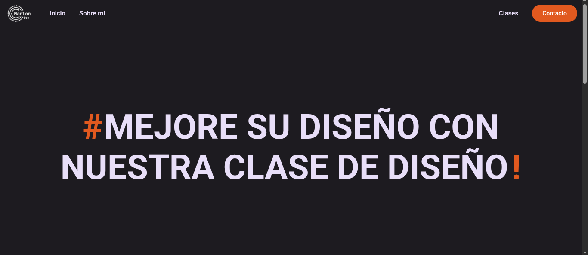
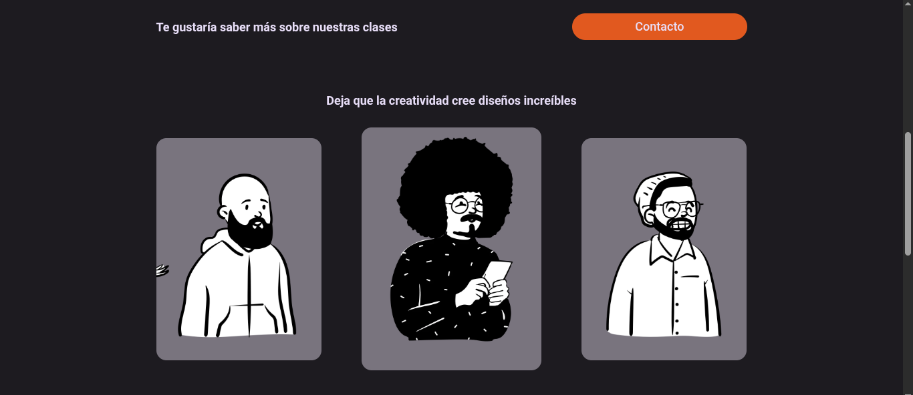
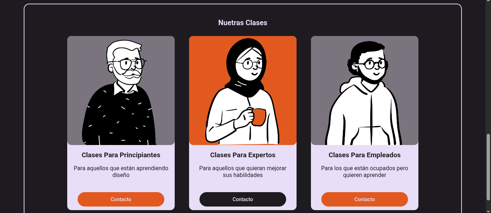

# React + Vite

Esta es una plantilla web ( SPA ). Que esta creada para practicar el estilo y modelo estandar de google con su librería de Material Design 3 
al igual que para practicar y mejorar mis habilidades para crear estilos.

&nbsp;  &nbsp;  &nbsp; 

